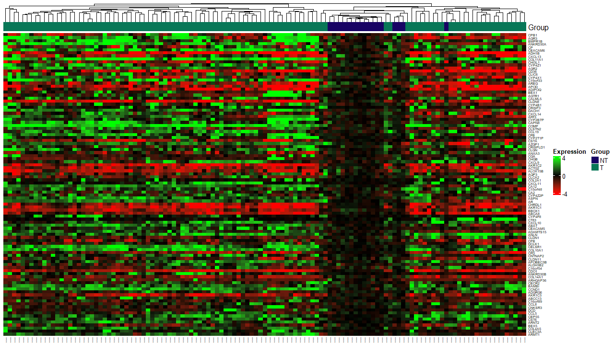
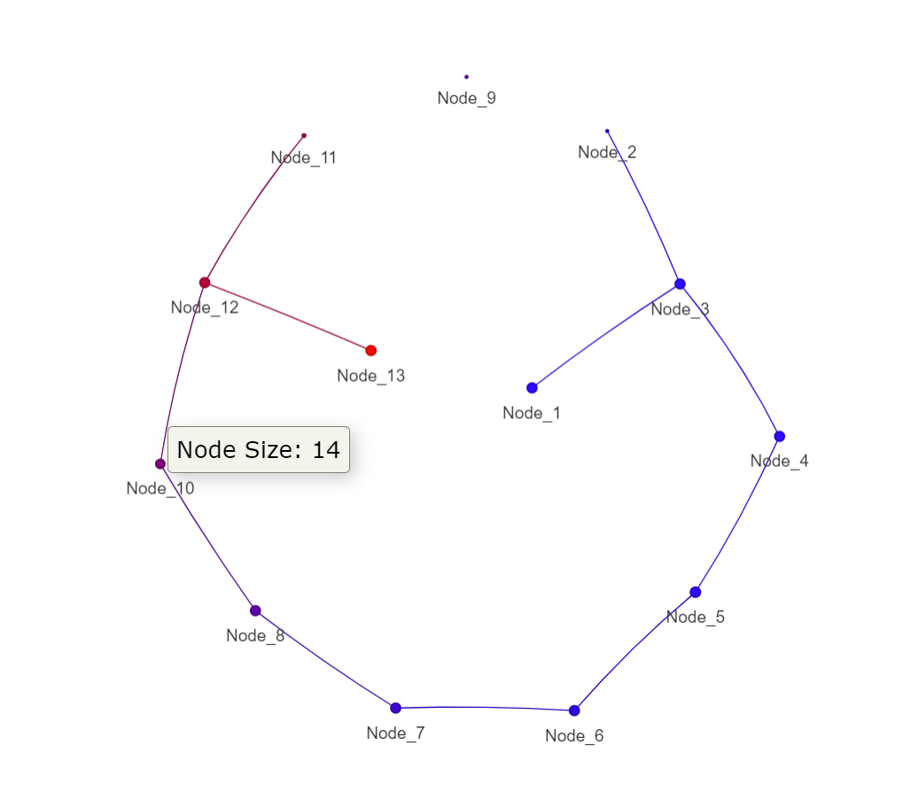

# GSSTDA: Gene Structure Survival using Topological Data Analysis
## Installation
You can install the released version of GSSTDA from [CRAN](https://CRAN.R-project.org) with:

``` r
install.packages("GSSTDA")
```

And you can install the development version from
[GitHub](https://github.com/raquelbosch/GSSTDAdev) with:

``` r
library(devtools)
devtools::install_github("jokergoo/ComplexHeatmap")

devtools::install_github("raquelbosch/GSSTDAdev")
library(GSSTDAdev)
```

### Installing the "ComplexHeatmap" Dependency from Bioconductor
The "ComplexHeatmap" package is a Bioconductor package required for some functionalities of our R package. To ensure it is correctly installed, please follow these steps:

*1. Install Bioconductor Manager*: First, ensure that the Bioconductor manager package is installed. You can do this by running the following command in your R console:
```{r}
if (!requireNamespace("BiocManager", quietly = TRUE))
    install.packages("BiocManager")

```

*2. Install ComplexHeatmap*: Once you have the Bioconductor manager installed, you can install the "ComplexHeatmap" package by executing:
```{r}
BiocManager::install("ComplexHeatmap")
```

*3. Load the package*: After installation, load "ComplexHeatmap" into your R session to verify that the installation was successful:
```{r}
library(ComplexHeatmap)
```

*4. Check for updates*: Bioconductor packages are updated regularly. It's a good practice to check for updates to ensure you have the latest version of "ComplexHeatmap". You can check for updates and install them by running:
```{r}
BiocManager::install()  # This updates all installed Bioconductor packages
```

By following these instructions, you should have the "ComplexHeatmap" package installed and ready for use with our package. If you encounter any issues during installation, please consult the Bioconductor support site or reach out for help through the community forums


## Loading data
* The *full data* is the expression matrix, 
* the *survival_time* is a vector with time between disease diagnosis and death, 
or other type of event, (if there has been no death, until the end of follow-up), 
* the *survival_event* is a vector with information  on whether or not the patient 
has died (or other type of event) 
* and the *case_tag* with information from each patient on whether he/she is 
healthy or not.

See *GSSTDA* documentation for further information.
```{r}
data("full_data")
data("survival_time")
data("survival_event")
data("case_tag")
```

## Declare the necessary parameters of the GSSTDA object.

The *gene_select_surv_type* parameter is used to choose the option on how to select the genes to be used in the calculation of the filter function. Choose between "Abs" and "Top_Bot". The *percent_gen_select_for_fun_filt* parameter is the percentage of genes to be selected to be used for this calculation.

The *gene_select_mapper_metric* parameter is used to choose the metric to be used in the selection of the genes for Mapper. The *percent_gen_select_for_mapper* parameter is the percentage of genes to be selected to be used in Mapper. 
```{r}
# Gene selection information
gene_select_surv_type <- "Top_Bot"
percent_gen_select_for_fun_filt <- 5 # Percentage of genes to be selected for filter funcion 
gene_select_mapper_metric <- "mad"
percent_gen_select_for_mapper <- 10 # Percentage of genes to be selected for Mapper
```

For the mapper, it is necessary to know the number of intervals into which the values of the filter functions will be divided and the overlap between them (\code{percent_overlap}). Default are, the root of the number of individuals included as input to Mapper, and 40, respectively. The set of overlapping intervals, called covering, can be constructed in two ways: the "classic" option and the "uniform" option. We recommend, and it is the fault, the "uniform" option. It is also necessary to choose the type of distance to be used for clustering within each interval (choose between correlation ("cor"), default, and euclidean ("euclidean")) and the clustering  type (choose between "hierarchical", default, and "PAM" (“partition around medoids”) options). 

For hierarchical clustering only, you will be asked by the console to choose the mode in which the number of clusters will be chosen (choose between "silhouette", default, and "standard"). If the mode is "standard" you can indicate the number of bins to generate the histogram (\code{num_bins_when_clustering}, by default 8). If the clustering method is "PAM", the default method will be "silhouette". Also, if the clustering type is hierarchical you can choose the type of linkage criteria (\code{linkage_type} choose between "single", "complete", "average" and "ward.D"). 

```{r}
#Mapper information
num_intervals <- 10
percent_overlap <- 40
type_covering <- "uniform"
distance_type <- "correlation"
clustering_type <- "hierarchical"
linkage_type <- "single" # only necessary if the type of clustering is hierarchical 
optimal_clustering_mode <- "silhouette"
# num_bins_when_clustering <- 10 # only necessary if the type of clustering is hierarchical 
                                 # and the optimal_clustering_mode is "standard"
                                 # (this is not the case)
                                 
```


The package allows the various steps required for GSSTDA to be performed separately or together in one function. 


### OPTION #1 (the three blocks of the G-SS-TDA process are in separate function):

#### First step of the process: dsga.

This analysis, developed by Nicolau *et al.* is independent of the rest of the process and can be used with the data for further analysis other than mapper. It allows the calculation of the "disease component" which consists of, through linear models, eliminating the part of the data that is considered normal or healthy and keeping only the component that is due to the disease.  

```{r}
dsga_object <- dsga(full_data, case_tag)


```

#### Second step of the process: Select the genes within the dsga object created in the previous step and calcute the values of the filtering functions.

This function selects the genes to be used in the Mapper according to their variability within the database. 

On the other hand, the genes with the strongest association with survival are selected. Using these genes, a filter function value is calculated for each sample, which captures the survival associated with each patient.

```{r}
gene_selection_object <- gene_selection(dsga_object, survival_time, survival_event,
                                        gene_select_surv_type,
                                        percent_gen_select_for_fun_filt,
                                        gene_select_mapper_metric,
                                        percent_gen_select_for_mapper)
```

Another option to execute the second step of the process. Create a object "data_object" with the require information. This could be used when you do not want to apply dsga.

```{r}
# Create data object
data_object <- list("full_data" = full_data, "case_tag" = case_tag)
class(data_object) <- "data_object"

#Select gene from data object
gene_selection_object <- gene_selection(data_object, survival_time, 
                                        survival_event, gene_select_surv_type,
                                        percent_gen_select_for_fun_filt,
                                        gene_select_mapper_metric,
                                        percent_gen_select_for_mapper)

```


#### Third step of the process: Create the mapper object with disease component matrix with only the selected genes and the filter function obtained in the gene selection step.

Mapper condenses the information of high-dimensional datasets into a combinatory graph that is referred to as the skeleton of the dataset. To do so, it divides the dataset into different levels according to its value of the filtering function. These levels overlap each other. Within each level, an independent clustering is performed using the input matrix and the indicated distance type. Subsequently, clusters from different levels that share patients with each other are joined by a vertex.

This function is independent from the rest and could be used without having done dsga and gene selection

In the PAD-S, only pathological samples are included in the Mapper graph.

```{r}
mapper_object <- mapper(data = gene_selection_object[["case_genes_disease_component"]], 
                        filter_values = gene_selection_object[["filter_values"]],
                        num_intervals = num_intervals,
                        percent_overlap = percent_overlap, 
                        type_covering = type_covering,
                        distance_type = distance_type,
                        clustering_type = clustering_type,
                        linkage_type = linkage_type, 
                        optimal_clustering_mode = optimal_clustering_mode, 
                        dim_reduction = FALSE)


```


Obtain information from the dsga block created in the previous step.

This function returns the 100 genes with the highest variability within 
the dataset and builds a heat map with them.
```{r}
dsga_information <- results_dsga(dsga_object[["matrix_disease_component"]], case_tag)
print(dsga_information)
```



Obtain information from the mapper object created in the G-SS-TDA process.
```{r}
print(mapper_object)
```

Plot the mapper graph.
```{r}
plot_mapper(mapper_object)
```



### OPTION #2 (all process integrate in the same function):

It creates the GSSTDA object with full data set, internally pre-process using the dsga technique, and the mapper information.
```{r}
gsstda_obj <- gsstda(full_data = full_data, survival_time = survival_time, 
                     survival_event = survival_event, case_tag = case_tag, 
                     gene_select_surv_type = gene_select_surv_type,
                     percent_gen_select_for_fun_filt = percent_gen_select_for_fun_filt,
                     gene_select_mapper_metric = gene_select_mapper_metric,
                     percent_gen_select_for_mapper = percent_gen_select_for_mapper,
                     num_intervals = num_intervals, 
                     percent_overlap = percent_overlap, 
                     type_covering = type_covering,
                     distance_type = distance_type, 
                     clustering_type = clustering_type, 
                     linkage_type = linkage_type, 
                     optimal_clustering_mode = optimal_clustering_mode,
                     dim_reduction = FALSE)

```

Obtain information from the dsga block created in the previous step.

This function returns the 100 genes with the highest variability within the dataset and builds a heat map with them.
```{r}
dsga_information <- results_dsga(gsstda_obj[["matrix_disease_component"]], case_tag)
print(dsga_information)
```


Obtain information from the mapper object created in the GSSTDA process.
```{r}
print(gsstda_obj[["mapper_obj"]])
```

Plot the mapper graph.
```{r}
plot_mapper(gsstda_obj[["mapper_obj"]])
```


### Options for representing the Mapper graph

#### Colouring nodes by the average value of a variable of interest.

The Mapper graph may be displayed colored by the average filter function values, or alternatively by another numerical variable of interest if one is supplied. For example, as in this case, by the average value of the "disease component" of a gene. Only pathological samples are included (\code{case_genes_disease_component}):

```{r }
variable_by_color <- gsstda_obj[["case_genes_disease_component"]]["ANLN",]
```
We recommend that you specify the name of the argument when calling the function.

```{r }
plot_mapper(gsstda_obj[["mapper_obj"]], variable_by_color = variable_by_color)
```

#### Representing the nodes with a pie chart showing the proportion of categories for a variable of interest.

This function reproduces the graph of a Mapper object in which each node is represented by a pie chart showing the proportion of each category of a variable of interest in each node.
For example, in this case, the mortality percentage for each node is represented.
The variable vector must have the name of the samples. 

```{r }
names(survival_event) <- colnames(full_data)
var_of_interest <- survival_event[case_tag == "T"]
```

```{r }
plot_mapper_with_pie_chart(gsstda_obj[["mapper_obj"]], var_of_interest,
                           name_var_of_interest = "Mortality percentage")
```

